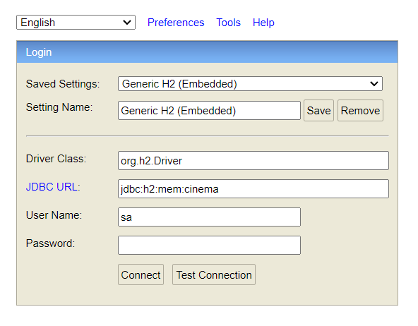
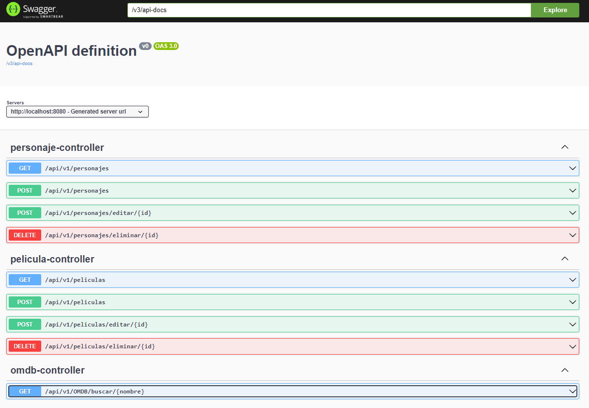
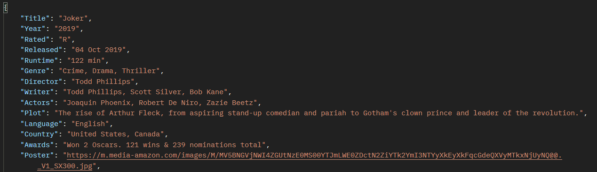

# Documentación de API Rest Cinema Softtek v1.0.0
## Descripción del proyecto

Este proyecto radica en la creación de una API Rest que permita tener un CRUD
para Peliculas y Personajes. Además, implementa el uso de una API externa
para consultar peliculas en especifico, utilizando peticiones a OMDB API.
___
## Recursos
El proyecto esta creado con las siguientes tecnologías y APIs.

| Plugin                | URL                      |
|-----------------------|--------------------------|
| Spring Web            | https://start.spring.io/ |
| Spring Data JPA       | https://start.spring.io/ |
| Lombok                | https://start.spring.io/ |
| H2 Database           | https://start.spring.io/ |
| Spring Doc (opcional) | https://springdoc.org/#getting-started |
| OMDB API              | https://www.omdbapi.com/ |
___
## Accesos

Acceso a la base de datos H2 mediante URL:

```sh
url: http://localhost:8080/h2-console/
user: sa
password: 
```


Acceso a la UI de la documentación de la API mediante URL:
```sh
url: http://localhost:8080/swagger-ui/index.html#/
```

___
## Uso en Postman

### Pelicula
#### GET
```sh
http://localhost:8080/api/v1/peliculas
```

### POST (crear Pelicula)
```sh
http://localhost:8080/api/v1/peliculas
```
Hay que insertar un JSON para esta petición.

``` json
{
    "titulo": "Avengers",
    "director": "Pérez Killian",
    "genero": "Acción",
    "duracion": "1h"
}
```

### POST (editar Pelicula)
```sh
http://localhost:8080/api/v1/peliculas/editar/1
```

Hay que insertar un JSON para esta petición.

``` json
{
    "idPelicula": 1,
    "titulo": "Avengers",
    "director": "Ruso Brothers",
    "genero": "Acción",
    "duracion": "1.5h"
}
```

### DELETE
```sh
http://localhost:8080/api/v1/peliculas/eliminar/1
```
___
### Personaje
#### GET
```sh
http://localhost:8080/api/v1/personajes
```

### POST (crear Personaje)
```sh
http://localhost:8080/api/v1/personajes
```
Hay que insertar un JSON para esta petición.

``` json
{
    "imagen": "",
    "nombre": "Ruso Brother 1",
    "edad": 38,
    "peso": 67,
    "historia": "Lorem ipsum...",
    "pelicula": {
        "idPelicula": 1
    }
}
```

### POST (editar Personaje)
```sh
http://localhost:8080/api/v1/personajes/editar/1
```

Hay que insertar un JSON para esta petición.

``` json
{
    "idPersonaje": 1,
    "imagen": "",
    "nombre": "Tony Stark",
    "edad": "38",
    "peso": "67",
    "historia": "Creador de la armadura Iron Man.",
    "pelicula": {
        "idPelicula": 1
    }
}
```

### DELETE
```sh
http://localhost:8080/api/v1/personajes/eliminar/1
```
---
### OMDB API
#### GET (buscar pelicula en particular)
```sh
http://localhost:8080/api/v1/OMDB/buscar/joker
```
Información recibida, en este caso se buscó la pelicula del Joker. Algunos inconvenientes
que podrían suceder es la API KEY, en este repositorio ya tiene integrado el TOKEN,
pero si se requiere se puede modificar desde el código y adjuntar el tuyo.


## Para más información

Documentación OMDB API: https://www.omdbapi.com/

Añadir SpringDoc: https://springdoc.org/#getting-started
